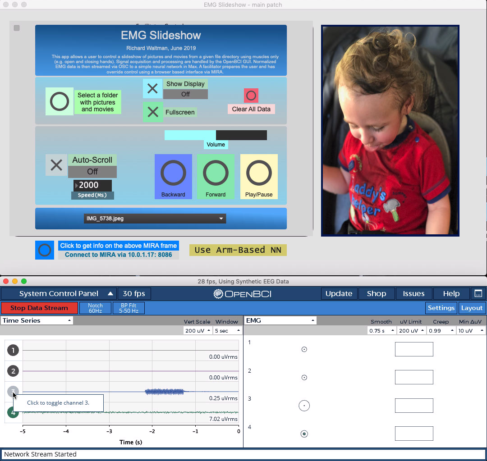

# EMG Slideshow

This app allows a user to control a slideshow of pictures and movies from a given file directory using muscles only (e.g. open and closing hands). Signal acquisition and processing are handled by the OpenBCI GUI. Normalized EMG data is then streamed via OSC to a simple neural network in Max. A facilitator prepares the user and has override control using a browser based interface via MIRA.

### Prerequisites

- OpenBCI Cyton or Ganglion
- [EMG/ECG Snap Electrode Cables](https://shop.openbci.com/collections/frontpage/products/emg-ecg-snap-electrode-cables)
- [EMG/ECG Foam Solid Gel Electrodes](https://shop.openbci.com/collections/frontpage/products/skintact-f301-pediatric-foam-solid-gel-electrodes-30-pack)
- [OpenBCI GUI](https://openbci.com/downloads)
- Windows or Mac computer
- Dedicated WiFi router (for wireless iPad/tablet control)
- iPad or other mobile device with a web browser

Optional:
- Secondary display
- HDMI or other video cable to connect to secondary display

### Installing

Install the OpenBCI GUI and connect with hardware, then stream the data to this app using Open Sound Control (OSC) via the Networking Widget.

### Setup
Use Channels 3 and 4 with either the Cyton or Ganglion. Refer to the following illustration for details:

## Built With

* [Max/MSP](https://cycling74.com/) - Visual Programming Language

## Versioning

We use [SemVer](http://semver.org/) for versioning. For the versions available, see the [tags on this repository](https://github.com/retiutut/emg_slideshow/tags). 

## Authors

##### Created by Richard Waltman, June 2019

## License

This project is licensed under the MIT License - see the [LICENSE.md](LICENSE.md) file for details

## THINGS I INSTALLED:
* ml.star (Max package manager)
